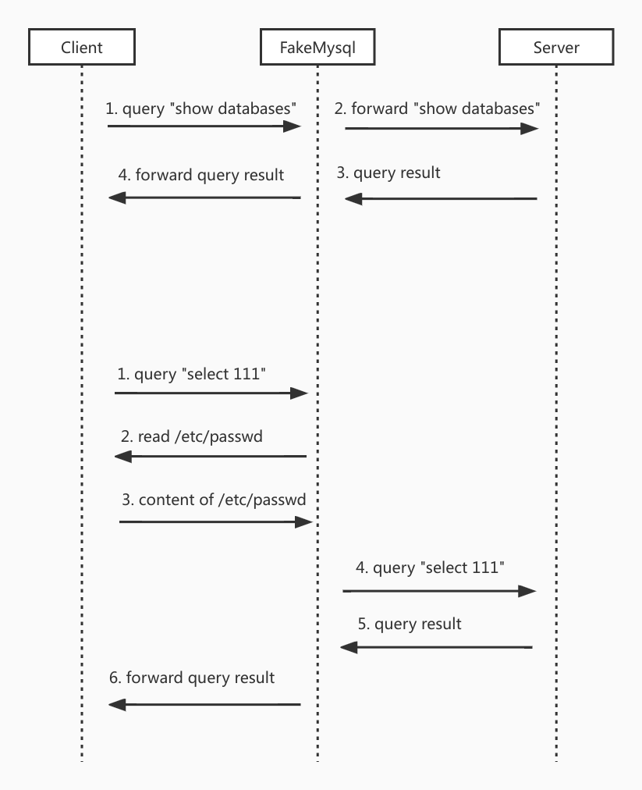

# EvilMySQL

用 golang 实现的 mysql 蜜罐

## 工作原理

`EvilMySQL` 充当中间人的角色，转发来自 mysql client/server 的流量，对 client 所有的 select 查询语句的返回报文进行修改达到文件读取。



## 使用

编译
```bash
go build -o server main.go
```

在 3306 端口启动一个 fake mysql，用户名为 `admin`, 密码为 `admin@123`,流量将转发到 `root:admin@tcp(127.0.0.1:6033)/mysql`
```bash
./server -u admin -P admin@123 -p 3306 -d root:admin@tcp(127.0.0.1:6033)/mysql
```

**目前仅支持 mysql_native_password 认证**